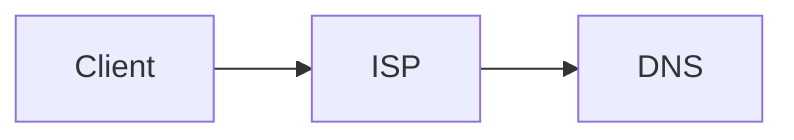
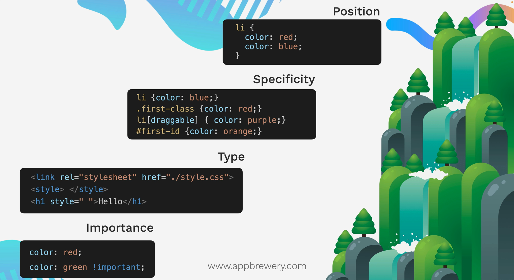
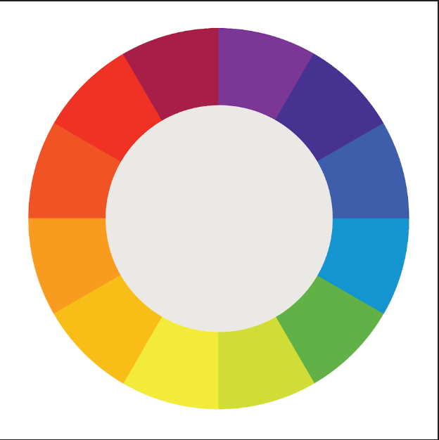

### How does Internet work?
Computers are connected through large extended wires which are used to transfer data/files from one place to another. Servers are used to provide the service of accessing the data.

Webserver - Active 24/7 and give you data any point of the day.




# Introduction to HTML

### What is HTML?
* Stands for Hyper Text Markup Language.
* Defines the content and structure of the website.


### Heading Element
* Used to create headings.
* h1 is the biggest and h6 is the smallest

Syntax
```
<h1> Heading1 </h1>
```

### Paragraph Element
* Used to define the paragraph.

Syntax
```
<p> This is a paragraph </p>
```

### Self closing tags
* Doesn't need closing tags.
* Example: hr

Syntax:
```
<hr/>
```

### List Element
* Ordered and Unordered List

Ordered list Syntax:
```
<ol> 
    <li> item1 </li>
    <li> item2 </li>
</ol>
```

Unordered list Syntax:
```
<ul> 
    <li> item1 </li>
    <li> item2 </li>
</ul>
```
* ordered list may contain numbers, roman numerics.
* unordered list may contian bullet points, squares.

### Anchor Element
* Used to add links. 
* Uses attribute **href**.

Attributes - Extra information about the tag.

Syntax:
```
<a href="https://www.google.com/"> This is a link</a>
```

### Image Element
* Used to add images in our website.
* Uses attribute **src**.
* Void element/ Self closing tag.
* Other attributes used: alt, height, width
    * alt - Used to give an alternate text for visual impairment peopel. Hence describing the image.
    * height - To set the height of the image.
    * width - To set the width of the image.


Syntax:
```

```

### File paths
* File paths are used to specify the location of a file.
* We have two types:
    * Absolute file path: 
    
    ```X:/WEB_DEVELOPMENT_JOURNEY/Projects/Project1/cake.jpg ``` : The absolute path fromt the directory.
    * Relative file path: 

    ```../Web_dev_journey/file1.docx ```: Used to search for file in previous directory.
    
    ```./Notes.md ```: Used to search for file in current directory.

# Introduction to CSS

### Why do we need CSS?
* Stands for **Cascading Style Sheet**.
* Used for styling our html page.

### How to add CSS?
* Inline - Same line as html element.

```<html style = "background:blue" ></html> ```
* Internal - Use style tag and css code is written inside it.
```
<style>
 body{
    background: red;
 }
</style>
```
* External - An additional css file extension is created and linked to our html file.

```
<head>
<link rel = "stylesheet" href = "styles.css">
</head>
 ``` 

### CSS selectors

1) Element selector
```
h2{
    color:red;
}
```

2) Class selector
```
.red-heading{
    color:red;
}
```

3) Id selector
```
#nav{
    color:red
}
```

4) Attribute selector
```
p[draggable]{
    color:red
}
```

5) Universal selector
```
*{
    color:red
}
```
### CSS colors 

1) Hex code - 000000(white) to ffffff(black)
2) RGB - (0,0,0)(white) to (255,255,255)(black)
3) RGBa - 'a' is for opacity
4) HSL - Hue saturation lightness 
5) HSLa - 'a' is for opacity

### CSS fonts

* Units
    * 1px - 1/96th inch
    * 1pt - 1/72nd inch  
    * 1em - 100% of parent
    * 1rem - 100% of root

### CSS Box Model


### CSS Inheritance

Position < Specifcity < Type < Importance 


### Combining CSS selectors
1) Group 
```
selector, selector{
    color: violet;
}
```

2) Child 
```
selector > selector {
    color: red;
}
```
3) Descendant
```
selector selector{
    color: blue;
}
```

4) Chaining
```
selectorselector{
    color: green;
}
```
5) Combining combiners
```
selector selectorselector{
    font-size: 0.5rem;
}
```
### CSS positioning
1) Static : default position
2) Relative : positioning relative to default position
3) Absolute : positon relative to nearest positioned ancestor
4) Fixed : Get fixed and doesn't move even if scrolled
 
Note: Z-index is used to set the position of an element below or above other element

### CSS display
1) Inline: Takes only needeed.
2) Block: Takes the whole width.
3) Inline-block: Allow us to set width and height and also keep it in Inline.
4) None: Disapper the element

### CSS float
Wrapping text using float and clear
```
img{
    float: right;
}
```
To clear the float from the footer type
```
footer{
    float: clear;
}
```

### How to create Responsive website?
There are 4 ways:
1) Media queries
2) CSS grid
3) CSS flexbox
4) External frameworks eg: bootstrap

### Media Queries

Adding breakpoints to define responsive layouts
```
div{
    background-color: red;
    height:200px;
    width:200px;
}

@media (max-width: 600px){
    div{
        height:100px;
        wifth:100px
    }
}
```

max-width and min-width can be used to set the boundary.

### CSS Flexbox
```
.container{
    display: flex;
    gap:10px;
    flex-direction: row;
    flex-basis: 100px;
}
```

#### Flexible Layout
Align, justify and wrap

``` order: 0; ```: applied to elements inside a container to give them an order

``` flex-wrap: wrap;```: wraps if there is no space horizontal

```justify-content: flex-start```: set on parent container

#### Flex Sizing
Shrinking and growing

content-width < Width < flex-basis < min-width/max-width 


### CSS Grid
* Good for 2D 

```
.container{
    display : grid;
    grid-template-columns: 1fr 2fr;
    grid-template-rows: 1fr 1fr;
    gap:10px;
}
```

### Grid Sizing
* Fixed
* Auto
* Min-max
* Fractions

### Grid item Placement
```
.item1{
        grid-column: span 2;
        grid-row: span 2;
}
```
### Bootstrap / CSS framework

* Has pre-made CSS tags and can be just copied to our project

## Web Design
* Important to attract people
* Principles: Color theory, Typography, User interface, User Experience Design(UX)

### Color Theory
* RED - love, energy, intensity
* YELLOW - joy, intellect, attention
* GREEN - freshness, safety, growth
* BLUE - stability, trust, serenity
* PURPLE - royalty, wealthy, feminity


Different ways of selectign color

1) Analogus Colors
2) Complementary / Clashing Colors 
3) Triadic Colors

Websites: [colorhunt.co](https://colorhunt.co/)

### Typography
* Typography significantly influences the mood and professionalism of a design.
* Serif fonts convey tradition, authority, and seriousness, inspired by historical marble carvings.
* Sans-serif fonts are modern, friendly, and highly readable, often preferred for body text.
* Combining two fonts with similar moods and contrasting serif styles enhances design clarity and appeal.

### User Interface
* Hierarchy in UI design guides users' attention by emphasizing important elements through size and color.
* Effective layout breaks content into manageable sections, improving readability and user engagement.
* Consistent alignment enhances the professional appearance and coherence of a design.
* White space elevates design quality by creating a minimalist, luxurious feel.
* Designing with the target audience in mind ensures the interface appeals appropriately and effectively.

### User Experience (UX) design
1) Simplicity
2) Consistency
3) Reading patterns
4) All platform design

# Introdcution to Javascript

### Javascript Alerts
```
alert("Hello")
```

### Data Types
1) String
2) Numbers
3) Boolean

```
typeof(123)
typeof("hello")
typeof(true)
```

### Variables
```
var myName = "Sujal";
```
### Naming Conventions
1) Meaaningful names 
2) Avoid keywords
3) No leading numbers
4) No spaces
5) Allowed character: $ _ 
6) Camel casing: myVariableName

### String concatenation
```
"Hello " + "world";
```
### String length
```
var name = "Sujal";
name.length;
```

### String Slicing
```
var name = "Sujal"
name.slice(0,4)
```

### String uppercase and lowercase
```
char.toUpperCase();
char.toLowerCase();
```

### Arithmetic and Modulo character
```
var a = 1+2
var b = 2-3
var c = 10/5
var d = 3*3
var e = 9%6
```

### Incrementation and Decrementation
```
x++ // x = x+1
x-- // x = x-1
```

### Functions
```
function sum(){
    return 2+4;
}

sum();

function diff(a,b){
    return a - b;
}

diff(4,2)
```

## Intermediate Javascript

### Random function
```
var n = Math.random(); //  0 - 0.9999999...
```

### Control statements
```
if (age>18){
    console.log("Eligible");
}

else{
    console.log("Not Eligible");
}
```

### Comparators and Equality
```
=== is equal to
!== is not equal to
> greater than
< lesser than
>= greater than or equal to
<= lesser than or equal to
```

### Combining Comparators
```
&& And
|| Or
! Not
```

## DOM (Document Object Model)
### Adding Javascript to websites
1. Inline JS
```
<body onload = "alert('Hello')">
```
2. Internal JS
```
<script type="tetx/javascript">
    alert("hello");
</script>
``` 
3. External JS
```
<script src="index.js" charset="utf-8"></script>
```

### Intro to DOM
* The Document Object Model (DOM) represents a web page as a tree of objects that can be selected and manipulated.
* Browsers convert HTML into the DOM tree structure when loading a web page.
* JavaScript can interact with the DOM to dynamically change content and styles without reloading the page.
* Objects in the DOM have properties (describing attributes) and methods (actions they can perform), accessible via dot notation.

```
document.firstElementChild; //selects the first child of html tag
```

### Selecting elements using DOM

```
document.getElementByTagName("ul"); // selects the ul tag

document.getElementByClassName("container"); // selects the container class

document.getElementById("image1") // selects the image1 tag

document.querySelector("h1"); // helps to select wide range of tags, id and classes. Just like we do in CSS.
```


### Manipulating styles of HTML element
```
document.querySelector("h1").style.color = "red";

document.querySelector("h1").style.fontSize = "10rem";

document.querySelector("h1").style.padding = "30%"
```

```
<button class="btn">click me</button>
```

Adding class to a list of classes of an element
```
document.querySelector("button").classList.add("invisible"); // added class invisible to the button
```

Removing class from a list of classes of an element
```
document.querySelector("button").classList.remove("invisible"); // removed class invisible from the button
```

Toggling if on then off else vice versa
```
document.querySelector("button").classList.toggle("invisible");
```

### Text manipulation and text content property
```
document.querySelector("h1").innerHTML="Good Bye"; // gives all the html inside the html tag

document.querySelector("h1").textContent="Hello World"; //only selects the text content
```

### Manipulating HTML element attributes
href, class, id , type etc are the attributes.

```
document.querySelector("a").attributes; //return all the attributes

document.querySelector("a").getAttribute("href"); //gives the value of the attribute

document.querySelector("a").setAttribute("href","https://www.google.com")
```

## Advance Javascript and DOM manipulation

### Adding event listeners to button
```
document.querySelector("button").addEventListener("click", handleClick) //two parameter (eventType, Listener/Function)

function handleClick(){
    alert("I got Clicked!");
}
``` 

### Higher order functions and passing functions

`   