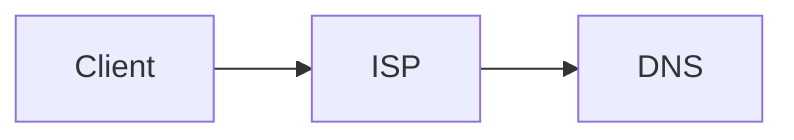

### How does Internet work?
Computers are connected through large extended wires which are used to transfer data/files from one place to another. Servers are used to provide the service of accessing the data.

Webserver - Active 24/7 and give you data any point of the day.




# Introduction to HTML

### What is HTML?
* Stands for Hyper Text Markup Language.
* Defines the content and structure of the website.


### Heading Element
* Used to create headings.
* h1 is the biggest and h6 is the smallest

Syntax
```
<h1> Heading1 </h1>
```

### Paragraph Element
* Used to define the paragraph.

Syntax
```
<p> This is a paragraph </p>
```

### Self closing tags
* Doesn't need closing tags.
* Example: hr

Syntax:
```
<hr/>
```

### List Element
* Ordered and Unordered List

Ordered list Syntax:
```
<ol> 
    <li> item1 </li>
    <li> item2 </li>
</ol>
```

Unordered list Syntax:
```
<ul> 
    <li> item1 </li>
    <li> item2 </li>
</ul>
```
* ordered list may contain numbers, roman numerics.
* unordered list may contian bullet points, squares.

### Anchor Element
* Used to add links. 
* Uses attribute **href**.

Attributes - Extra information about the tag.

Syntax:
```
<a href="https://www.google.com/"> This is a link</a>
```

### Image Element
* Used to add images in our website.
* Uses attribute **src**.
* Void element/ Self closing tag.
* Other attributes used: alt, height, width
    * alt - Used to give an alternate text for visual impairment peopel. Hence describing the image.
    * height - To set the height of the image.
    * width - To set the width of the image.


Syntax:
```

```

### File paths
* File paths are used to specify the location of a file.
* We have two types:
    * Absolute file path: 
    
    ```X:/WEB_DEVELOPMENT_JOURNEY/Projects/Project1/cake.jpg ``` : The absolute path fromt the directory.
    * Relative file path: 

    ```../Web_dev_journey/file1.docx ```: Used to search for file in previous directory.
    
    ```./Notes.md ```: Used to search for file in current directory.

# Introduction to CSS

### Why do we need CSS?
* Stands for **Cascading Style Sheet**.
* Used for styling our html page.

### How to add CSS?
* Inline - Same line as html element.

```<html style = "background:blue" ></html> ```
* Internal - Use style tag and css code is written inside it.
```
<style>
 body{
    background: red;
 }
</style>
```
* External - An additional css file extension is created and linked to our html file.

```
<head>
<link rel = "stylesheet" href = "styles.css">
</head>
 ``` 

### CSS selectors

1) Element selector
```
h2{
    color:red;
}
```

2) Class selector
```
.red-heading{
    color:red;
}
```

3) Id selector
```
#nav{
    color:red
}
```

4) Attribute selector
```
p[draggable]{
    color:red
}
```

5) Universal selector
```
*{
    color:red
}
```
### CSS colors 

1) Hex code - 000000(white) to ffffff(black)
2) RGB - (0,0,0)(white) to (255,255,255)(black)
3) RGBa - 'a' is for opacity
4) HSL - Hue saturation lightness 
5) HSLa - 'a' is for opacity

### CSS fonts

* Units
    * 1px - 1/96th inch
    * 1pt - 1/72nd inch  
    * 1em - 100% of parent
    * 1rem - 100% of root

### CSS Box Model


### CSS Inheritance

Position < Specifcity < Type < Importance 


### Combining CSS selectors
1) Group 
```
selector, selector{
    color: violet;
}
```

2) Child 
```
selector > selector {
    color: red;
}
```
3) Descendant
```
selector selector{
    color: blue;
}
```

4) Chaining
```
selectorselector{
    color: green;
}
```
5) Combining combiners
```
selector selectorselector{
    font-size: 0.5rem;
}
```
### CSS positioning
1) Static : default position
2) Relative : positioning relative to default position
3) Absolute : positon relative to nearest positioned ancestor
4) Fixed : Get fixed and doesn't move even if scrolled
 
Note: Z-index is used to set the position of an element below or above other element

### CSS display
1) Inline: Takes only needeed.
2) Block: Takes the whole width.
3) Inline-block: Allow us to set width and height and also keep it in Inline.
4) None: Disapper the element


