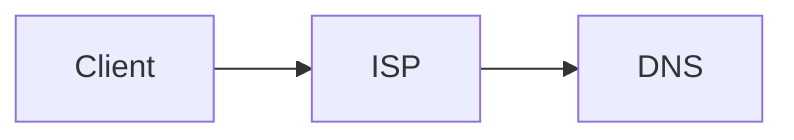

### How does Internet work?
Computers are connected through large extended wires which are used to transfer data/files from one place to another. Servers are used to provide the service of accessing the data.

Webserver - Active 24/7 and give you data any point of the day.




# Introduction to HTML

### What is HTML?
* Stands for Hyper Text Markup Language.
* Defines the content and structure of the website.


### Heading Element
* Used to create headings.
* h1 is the biggest and h6 is the smallest

Syntax
```
<h1> Heading1 </h1>
```

### Paragraph Element
* Used to define the paragraph.

Syntax
```
<p> This is a paragraph </p>
```

### Self closing tags
* Doesn't need closing tags.
* Example: hr

Syntax:
```
<hr/>
```

### List Element
* Ordered and Unordered List

Ordered list Syntax:
```
<ol> 
    <li> item1 </li>
    <li> item2 </li>
</ol>
```

Unordered list Syntax:
```
<ul> 
    <li> item1 </li>
    <li> item2 </li>
</ul>
```
* ordered list may contain numbers, roman numerics.
* unordered list may contian bullet points, squares.

### Anchor Element
* Used to add links. 
* Uses attribute **href**.

Attributes - Extra information about the tag.

Syntax:
```
<a href="https://www.google.com/"> This is a link</a>
```

### Image Element
* Used to add images in our website.
* Uses attribute **src**.
* Void element/ Self closing tag.
* Other attributes used: alt, height, width
    * alt - Used to give an alternate text for visual impairment peopel. Hence describing the image.
    * height - To set the height of the image.
    * width - To set the width of the image.


Syntax:
```

```

### File paths
* File paths are used to specify the location of a file.
* We have two types:
    * Absolute file path: 
    
    ```X:/WEB_DEVELOPMENT_JOURNEY/Projects/Project1/cake.jpg ``` : The absolute path fromt the directory.
    * Relative file path: 

    ```../Web_dev_journey/file1.docx ```: Used to search for file in previous directory.
    
    ```./Notes.md ```: Used to search for file in current directory.

### HTML FORMS
```
<form action="\login" method="POST">
    <label for="email">Email</label>
    <input type="text" name="email" required>
    <label for="password">Password</label>
    <input type="text" name="password" required>
    <input type="submit" value="Submit">
</form>
```

# Introduction to CSS

### Why do we need CSS?
* Stands for **Cascading Style Sheet**.
* Used for styling our html page.

### How to add CSS?
* Inline - Same line as html element.

```<html style = "background:blue" ></html> ```
* Internal - Use style tag and css code is written inside it.
```
<style>
 body{
    background: red;
 }
</style>
```
* External - An additional css file extension is created and linked to our html file.

```
<head>
<link rel = "stylesheet" href = "styles.css">
</head>
 ``` 

### CSS selectors

1) Element selector
```
h2{
    color:red;
}
```

2) Class selector
```
.red-heading{
    color:red;
}
```

3) Id selector
```
#nav{
    color:red
}
```

4) Attribute selector
```
p[draggable]{
    color:red
}
```

5) Universal selector
```
*{
    color:red
}
```
### CSS colors 

1) Hex code - 000000(white) to ffffff(black)
2) RGB - (0,0,0)(white) to (255,255,255)(black)
3) RGBa - 'a' is for opacity
4) HSL - Hue saturation lightness 
5) HSLa - 'a' is for opacity

### CSS fonts

* Units
    * 1px - 1/96th inch
    * 1pt - 1/72nd inch  
    * 1em - 100% of parent
    * 1rem - 100% of root

### CSS Box Model


### CSS Inheritance

Position < Specifcity < Type < Importance 


### Combining CSS selectors
1) Group 
```
selector, selector{
    color: violet;
}
```

2) Child 
```
selector > selector {
    color: red;
}
```
3) Descendant
```
selector selector{
    color: blue;
}
```

4) Chaining
```
selectorselector{
    color: green;
}
```
5) Combining combiners
```
selector selectorselector{
    font-size: 0.5rem;
}
```
### CSS positioning
1) Static : default position
2) Relative : positioning relative to default position
3) Absolute : positon relative to nearest positioned ancestor
4) Fixed : Get fixed and doesn't move even if scrolled
 
Note: Z-index is used to set the position of an element below or above other element

### CSS display
1) Inline: Takes only needeed.
2) Block: Takes the whole width.
3) Inline-block: Allow us to set width and height and also keep it in Inline.
4) None: Disapper the element

### CSS float
Wrapping text using float and clear
```
img{
    float: right;
}
```
To clear the float from the footer type
```
footer{
    float: clear;
}
```

### How to create Responsive website?
There are 4 ways:
1) Media queries
2) CSS grid
3) CSS flexbox
4) External frameworks eg: bootstrap

### Media Queries

Adding breakpoints to define responsive layouts
```
div{
    background-color: red;
    height:200px;
    width:200px;
}

@media (max-width: 600px){
    div{
        height:100px;
        wifth:100px
    }
}
```

max-width and min-width can be used to set the boundary.

### CSS Flexbox
```
.container{
    display: flex;
    gap:10px;
    flex-direction: row;
    flex-basis: 100px;
}
```

#### Flexible Layout
Align, justify and wrap

``` order: 0; ```: applied to elements inside a container to give them an order

``` flex-wrap: wrap;```: wraps if there is no space horizontal

```justify-content: flex-start```: set on parent container

#### Flex Sizing
Shrinking and growing

content-width < Width < flex-basis < min-width/max-width 


### CSS Grid
* Good for 2D 

```
.container{
    display : grid;
    grid-template-columns: 1fr 2fr;
    grid-template-rows: 1fr 1fr;
    gap:10px;
}
```

### Grid Sizing
* Fixed
* Auto
* Min-max
* Fractions

### Grid item Placement
```
.item1{
        grid-column: span 2;
        grid-row: span 2;
}
```
### Bootstrap / CSS framework

* Has pre-made CSS tags and can be just copied to our project

## Web Design
* Important to attract people
* Principles: Color theory, Typography, User interface, User Experience Design(UX)

### Color Theory
* RED - love, energy, intensity
* YELLOW - joy, intellect, attention
* GREEN - freshness, safety, growth
* BLUE - stability, trust, serenity
* PURPLE - royalty, wealthy, feminity


Different ways of selectign color

1) Analogus Colors
2) Complementary / Clashing Colors 
3) Triadic Colors

Websites: [colorhunt.co](https://colorhunt.co/)

### Typography
* Typography significantly influences the mood and professionalism of a design.
* Serif fonts convey tradition, authority, and seriousness, inspired by historical marble carvings.
* Sans-serif fonts are modern, friendly, and highly readable, often preferred for body text.
* Combining two fonts with similar moods and contrasting serif styles enhances design clarity and appeal.

### User Interface
* Hierarchy in UI design guides users' attention by emphasizing important elements through size and color.
* Effective layout breaks content into manageable sections, improving readability and user engagement.
* Consistent alignment enhances the professional appearance and coherence of a design.
* White space elevates design quality by creating a minimalist, luxurious feel.
* Designing with the target audience in mind ensures the interface appeals appropriately and effectively.

### User Experience (UX) design
1) Simplicity
2) Consistency
3) Reading patterns
4) All platform design

# Introdcution to Javascript

### Javascript Alerts
```
alert("Hello")
```

### Data Types
1) String
2) Numbers
3) Boolean

```
typeof(123)
typeof("hello")
typeof(true)
```

### Variables
```
var myName = "Sujal";
```
### Naming Conventions
1) Meaaningful names 
2) Avoid keywords
3) No leading numbers
4) No spaces
5) Allowed character: $ _ 
6) Camel casing: myVariableName

### String concatenation
```
"Hello " + "world";
```
### String length
```
var name = "Sujal";
name.length;
```

### String Slicing
```
var name = "Sujal"
name.slice(0,4)
```

### String uppercase and lowercase
```
char.toUpperCase();
char.toLowerCase();
```

### Arithmetic and Modulo character
```
var a = 1+2
var b = 2-3
var c = 10/5
var d = 3*3
var e = 9%6
```

### Incrementation and Decrementation
```
x++ // x = x+1
x-- // x = x-1
```

### Functions
```
function sum(){
    return 2+4;
}

sum();

function diff(a,b){
    return a - b;
}

diff(4,2)
```

## Intermediate Javascript

### Random function
```
var n = Math.random(); //  0 - 0.9999999...
```

### Control statements
```
if (age>18){
    console.log("Eligible");
}

else{
    console.log("Not Eligible");
}
```

### Comparators and Equality
```
=== is equal to
!== is not equal to
> greater than
< lesser than
>= greater than or equal to
<= lesser than or equal to
```

### Combining Comparators
```
&& And
|| Or
! Not
```

## DOM (Document Object Model)
### Adding Javascript to websites
1. Inline JS
```
<body onload = "alert('Hello')">
```
2. Internal JS
```
<script type="tetx/javascript">
    alert("hello");
</script>
``` 
3. External JS
```
<script src="index.js" charset="utf-8"></script>
```

### Intro to DOM
* The Document Object Model (DOM) represents a web page as a tree of objects that can be selected and manipulated.
* Browsers convert HTML into the DOM tree structure when loading a web page.
* JavaScript can interact with the DOM to dynamically change content and styles without reloading the page.
* Objects in the DOM have properties (describing attributes) and methods (actions they can perform), accessible via dot notation.

```
document.firstElementChild; //selects the first child of html tag
```

### Selecting elements using DOM

```
document.getElementByTagName("ul"); // selects the ul tag

document.getElementByClassName("container"); // selects the container class

document.getElementById("image1") // selects the image1 tag

document.querySelector("h1"); // helps to select wide range of tags, id and classes. Just like we do in CSS.
```


### Manipulating styles of HTML element
```
document.querySelector("h1").style.color = "red";

document.querySelector("h1").style.fontSize = "10rem";

document.querySelector("h1").style.padding = "30%"
```

```
<button class="btn">click me</button>
```

Adding class to a list of classes of an element
```
document.querySelector("button").classList.add("invisible"); // added class invisible to the button
```

Removing class from a list of classes of an element
```
document.querySelector("button").classList.remove("invisible"); // removed class invisible from the button
```

Toggling if on then off else vice versa
```
document.querySelector("button").classList.toggle("invisible");
```

### Text manipulation and text content property
```
document.querySelector("h1").innerHTML="Good Bye"; // gives all the html inside the html tag

document.querySelector("h1").textContent="Hello World"; //only selects the text content
```

### Manipulating HTML element attributes
href, class, id , type etc are the attributes.

```
document.querySelector("a").attributes; //return all the attributes

document.querySelector("a").getAttribute("href"); //gives the value of the attribute

document.querySelector("a").setAttribute("href","https://www.google.com")
```

## Advance Javascript and DOM manipulation

### Adding event listeners to button
```
document.querySelector("button").addEventListener("click", handleClick) //two parameter (eventType, Listener/Function)

function handleClick(){
    alert("I got Clicked!");
}
``` 

### Higher order functions and passing functions

Higher order functions are functions which can take other functions as inputs.
```
function add(num1, num2){
    return num1 + num2;
}

function multiply(num1, num2){
    return num1 * num2;
}

function calculator(num1, num2, operator){
    return operator(num1, num2);
}

calculator(4, 5, add)
```

```
debugger; // can be used to look after every step for debugging an error
calculator(3, 4, multiply);
```

### Switch statements
```
switch(expression){
    case expression:
        <body>
        breaks;

    default:
}
```

### Javascript Objects
```
var houseKeeper1 = {
    yearOfExperience: 12,
    name: 'Jane',
    cleaningReertoire: ['bathroom', 'lobby', 'bedroom']
}
```

### Constructor Functions
camelcase isn't used and the first letter is capitalized
```
function BellBoy(name, age, hasWorkPermit, languages){
    this.name = name;
    this.age = age;
    this.hasWorkPermit = hasWorkPermit;
    this.language = langauge;
    function moveSuitcase(){
        console.log("picked");
    }
}

//initialize object
var bellBoy1 = new BellBoy("Timmy", 19, true, ['French', 'English']);

bellBoy1.moveSuitcase(); // using methods - calling methods here
```

### Callbacks and how to respond to events
A callback function in JavaScript is a function that is passed as an argument to another function, and is intended to be executed at a later time, typically after the completion of some operation within the receiving function.
```
document.addEventListener("keypress",respondToKey(event));

function respondTokey(event){
    console.log("Key Pressed");
}
```

## Jquery
Library which contains code that has been written by someone else and can be incorporated in our own code. Helps to write the code we want in smaller syntax.

### How to incorporate the jquery
1) Downlaoding the files
2) Use googles CDN

Selecting elements
```
$("h1");
```
Manipulating CSS
```
$("h1").css("color","green");

$("h1").addClass("class1");

$("h1").removeClass("class1);

$("h1").hasClass("class1);

```

Manipulating Text
```
$("h1").text("Goodbye");

$("button").html("<em>Hey</em>);
```

Manipulating attributes
```
$("img").attr("src","");
```

Adding event listener
```
$("h1").click(function(){
    $("h1").css("color","purple");
}
);
```

Adding and removing Elements
```
$("h1").before("<button>New</button>");

$("h1").after("<button>New</button>");

$("h1").prepend("<button>New</button>");

$("h1").append("<button>New</button>");
```

Animation
```
$("button").on("click",function(){
    $("h1").hide();
});

$("button").on("click",function(){
    $("h1").show();
});

$("button").on("click",function(){
    $("h1").toggle();
});

$("button").on("click",function(){
    $("h1").fadeOut();
});

$("button").on("click",function(){
    $("h1").fadeIn();
});

$("button").on("click",function(){
    $("h1").fadeToggle();
});

$("button").on("click",function(){
    $("h1").slideUp();
});

$("button").on("click",function(){
    $("h1").slideDown();
});

$("button").on("click",function(){
    $("h1").slideToggle();
});

$("button").on("click",function(){
    $("h1").animate({
        opacity: 0.5
    }); //allows to create custom css but stick to numeric value attributes
});

``` 

### GIT BASH
* The Shell in computing refers to the user interface that allows you, as a human, to interact with the Kernel and, in turn, with the hardware of your computer.
* There are two variants of the shell:
    1) Graphical User Interface (GUI) Shells: For example, when you open Finder, you are using a graphical user interface to access and find your files.
    2) Command Line Interface (CLI): This is what we will be discussing and learning about in this module. It is an alternative way of interfacing with the Kernel.
* BASH - Bourne Again Shell
* Some commands
    * cd : Used to change directory
        * ```cd..``` to move back
    * ls : List all directories and files
    * mkrdir : To make a new directory
    * touch : To create a file
    * open : To open a file (automatically detects the application to be used)
        * ```open -a <ApplicationName> Text2.txt``` We can also specify the application to be used 
    * rm : To remove the file from the directory
        * ```rm *``` to remove all the files from the directory
        * ```rm -r <filename>``` will be used to remove the directory with all the files and subfolder inside it
    * pwd : To check the name of current directory

# Node JS

### What is a framework?

Pre-built components that can be used to create a application reducing overhead and components.

Node js is not exactly a framework, it's an asynchronous event-driven **Javascript runtime**, Node js is designed to build scalable network applications. 

Node REPL (Read Eval Print Loop) - Computer environment where user inputs are read and evaluated and the results are returned to the user.

### What are Native Modules?
Pre-bundled modules that can used by users for their own code.

Example: 1) File System - allows to access Local storage. 
```
const fs = require("fs");

fs.writeFile("message.txt","Hello world", (err)=>{
    if err throw err;
    console.log("The File has been saved");
})
```

ECAscript Modules: Uses **import** keyword instead of **require** keyword. It's asynchronours so it's better.

# Express JS
A framework that is developed on Node js. 

Fun Fact: VS code was made using node js.

Creating an Express server:

Step1: Create a directory

Step2: Create index.js file

Step3: Initialise NPM

Step4: Install the Express package

Step5: Write Server application in index.js

Step6: Start Server 
```
import express from "express"
const app = express();
const port = 3000
app.listen(port, ()=>{
    console.log(`Server running on port ${port}.`);
});
```

### HTTP
Request vocab

1) GET: Requesting a resource from the server. 
2) POST: Sending a resource to the server.
3) PUT: Replace a resource with whatever you are sending.
4) PATCH: Patch up the resource.
5) DELETE: Deletes a resource from the server.

**Nodemon**: A tool which automatically restarts the server if any changes is detected.

### HTTP response status codes
1) Informational responses (100-199)
2) Successful responses (200-299)
3) Redirection messages (300-399)
4) Client error responses (400-499)
5) Server error responses (500-599)

### POSTMAN
When developing APIs or back-end services, you might not have a front-end ready to test your HTTP requests. Postman is a popular tool that allows you to test GET, POST, PUT, PATCH, and DELETE requests easily.

### Express Middlewares
Middleware is a component that sits between the raw incoming requests and the route handlers. When a request arrives at the server, before it is processed by route handlers such as GET, POST, or PUT functions, middleware can operate on these requests before they reach their final destinations.

Functions of Middleware
Middleware can perform several functions before allowing the request to proceed:

* **Pre-processing requests**: When a request might be handled by multiple handlers (GET, POST, PUT), middleware can modify aspects of the request or perform operations on it before routing.
* **Logging**: Middleware can log details such as the time taken for the request, the request type (GET, PUT, POST, etc.), and the status of the request handling.
* **Authentication**: Middleware can verify if the incoming request originates from an authorized client before allowing access to backend handlers.
* **Error handling**: Middleware can identify and manage errors in requests before

### HTML FORMS
```
<form action="\login" method="POST">
    <label for="email">Email</label>
    <input type="text" name="email" required>
    <label for="password">Password</label>
    <input type="text" name="password" required>
    <input type="submit" value="Submit">
</form>
```